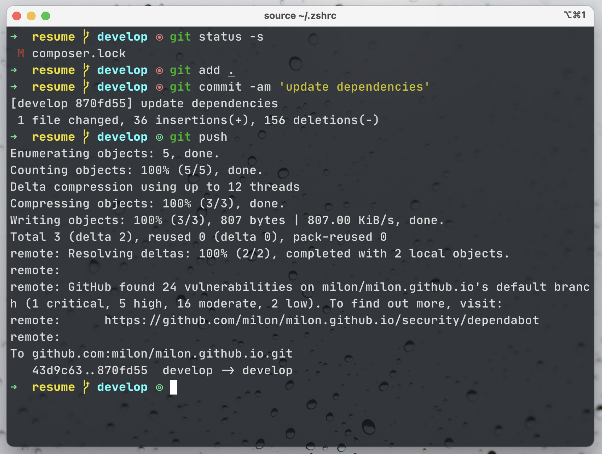

# arrow-zsh-theme

A minimal theme for zsh shell

## Installation

### Antigen

```
antigen theme milon/arrow-zsh-theme
```

### Manual

Copy `[arrow.zsh-theme](https://github.com/milon/arrow-zsh-theme/blob/master/arrow.zsh-theme)` file to `~/.oh-my-zsh/custom/themes/` folder.

This set of commands will probably do what you want:

```
git clone https://github.com/milon/arrow-zsh-theme.git
ln -s $PWD/arrow-zsh-theme/sobole.zsh-theme ~/.oh-my-zsh/custom/themes/arrow.zsh-theme
```

Then set `ZSH_THEME="arrow"` inside your `.zshrc` file.

## Screenshot



## Developer

Nuruzzaman Milon <br/>
https://milon.im
